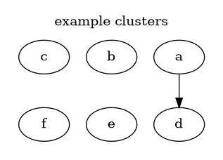

```puml
@startdot test
digraph example_clusters {
    rankdir=TB
    peripheries=0

    subgraph cluster_0 {
        label="example clusters"
        a b c
    }
    subgraph cluster_1 {
        d e f
    }

    a -> d
}
@enddot
```
