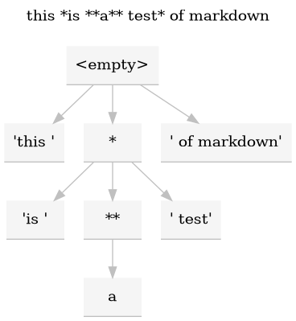

```puml
@startdot test

digraph test {
    graph [
        rankdir=TB
        bgcolor=transparent
    
        label="this *is **a** test* of markdown\n\n"
        labelloc=t
    ]

    node [
        shape=underline
        style=filled
        color=silver
        fillcolor=whitesmoke
    ]
    
    edge [
        color=silver    
    ]

    t1 [label="<empty>"]
    t2 [label="'this '"]

    t3 [label="*"]
    t4 [label="'is '"]

    t5 [label="**"]
    t6 [label="a"]

    t7 [label="' test'"]

    t8 [label="' of markdown'"]

    t1 -> t2
    t1 -> t3
    t1 -> t8
    t3 -> t4
    t3 -> t5
    t3 -> t7
    t5 -> t6
}
@enddot
```
